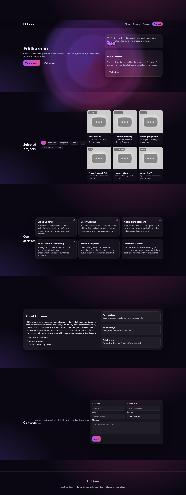

# Editkaro_portfolio
A modern and responsive landing page inspired by EditKaro, built with HTML, CSS, and JavaScript.  Includes smooth animations, glassmorphism effects, rotating 3D background shapes,  and sections like Projects, Services, About, and Contact Form.
# 🎬 EditKaro – Mini Project

A simple and creative project inspired by **EditKaro.in**, showcasing smooth scrolling sections, background animations, and integrated social media + project demos.

---

## ✨ Features
- 🎨 Beautiful UI with smooth scrolling between sections  
- 🌈 Animated background effects for modern look  
- 🔗 Social media integration (Instagram, Facebook, YouTube)  
- 🎥 Project demo video embedded directly in the **Projects** section  
- 📱 Fully responsive design (works on mobile & desktop)  

---

## 📂 Project Structure
📁 EditKaro-Project
┣ 📂 assets # images/icons used
┣ 📂 css # style files
┣ 📂 js # JavaScript files
┣ 📄 index.html # main project page
┗ 📄 README.md # documentation

## 📸 Preview
  
